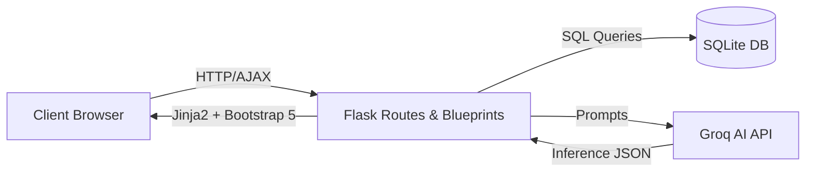

# WorkSense AI
### AI-Powered Workplace Productivity & Meeting Intelligence Platform


---

## 📌 Overview

**Problem Statement**  
Modern teams lose countless hours sifting through unstructured meeting transcripts, scattered notes, and long documents. Critical action items are forgotten, risks go unnoticed, and measuring true team productivity remains a guessing game. 

**Solution**  
WorkSense AI is a comprehensive Enterprise SaaS solution that automatically turns messy meeting transcripts and documents into structured insights. Using advanced Large Language Models (LLMs), it acts as an intelligent workplace manager.

**Why WorkSense AI was built**  
This platform was built to demonstrate how generative AI can be integrated seamlessly into enterprise workflows without sacrificing speed or security. Designed with a robust Flask architecture, it handles heavy natural language processing efficiently.

**Key Benefits**  
- ⏱️ **Save Time:** Instantly summarize hour-long meetings and massive documents.
- 🎯 **Stay Organized:** Automatically extract action items and assign deadlines.
- 🚨 **Mitigate Risk:** Let AI flag potential project roadblocks before they happen.
- 📈 **Track Progress:** Visualize team productivity and health over time.

---

## 🚀 Features

### Authentication
- Secure Login & Registration
- Persistent Session Management (Flask-Session)
- Hashed Password Security

### Executive Dashboard
- Real-time KPIs & Stats
- Dynamic Productivity Score
- Automated Meeting Health analysis
- Upcoming Deadlines tracking
- Auto-generated Executive Briefs

### Meeting Intelligence
- Raw Transcript Analysis via Groq AI
- Automatic Action Item Extraction
- Risk Detection & Deadlines
- Manager Insights Generation

### Document Intelligence
- PDF and DOCX Uploading & Parsing
- AI Summarization of massive files
- Context-Aware Document Q&A

### AI Workplace Assistant
- Context-aware AI Chat Interface
- Retains Meeting, Document, and Task Context automatically
- Answers questions based *only* on your uploaded workplace data

### Reports & Meeting History
- Searchable history of all processed meetings
- View structured JSON data cleanly
- Delete records
- One-click PDF Export of full reports

### Analytics
- Interactive Plotly.js Charts
- Productivity Trends over time
- Meeting Volume Analytics
- Risk Distribution mapping

### Risk Center
- Proactive AI Risk Detection
- Categorized Risk Dashboard (High, Medium, Low)

### Smart Task Manager
- Manual & Auto-generated Task Creation
- Status Tracking (Pending, In Progress, Completed)
- Priority Management

### Email Automation
- AI Email Generation based on Meeting Context
- Professional drafting (Follow-ups, Summaries, Reminders)
- Copy to Clipboard
- PDF/TXT Export

### Weekly Progress Reports
- AI-generated summaries of completed and pending tasks
- Downloadable weekly snapshots

### Executive Brief History
- Search and manage historical AI-generated executive summaries

### Profile & Settings
- User Profile management
- Password updates

### About
- Project architecture and tech stack overview

---

## 🛠️ Tech Stack

**Backend**
- Python 3.x
- Flask (Blueprints, Routing)
- SQLite (Relational Database)
- Groq API (LLaMA 3 Fast Inference)
- ReportLab (PDF Generation)

**Frontend**
- HTML5 & CSS3
- Bootstrap 5 (Responsive UI)
- Vanilla JavaScript & AJAX (Fetch API)
- Plotly.js (Data Visualization)

**AI & Database**
- Groq LLaMA (Intelligence Engine)
- SQLite (Persistence Layer)

---

## 🏗️ System Architecture



---

## 📁 Folder Structure

```text
.
├── flask_app/
│   ├── blueprints/      # Modular Flask routing (auth, dashboard, meetings, etc.)
│   ├── templates/       # Jinja2 HTML templates
│   └── static/          # Static assets (css, js, images)
├── utils/               # Core business logic (db.py, groq_client.py, etc.)
├── prompts/             # System instructions & AI prompt templates
├── flask_run.py         # Main application entry point
├── requirements.txt     # Python dependencies
├── Procfile             # Gunicorn deployment config
├── render.yaml          # Render PaaS configuration
└── README.md
```

---

## 💻 Installation

Clone the repository:
```bash
git clone https://github.com/velpulanagalakshmi179-glitch/WorkSense-AI-.git
cd WorkSense-AI-
```

Create and activate a virtual environment:
```bash
python -m venv venv
# On Windows:
venv\Scripts\activate
# On Mac/Linux:
source venv/bin/activate
```

Install the dependencies:
```bash
pip install -r requirements.txt
```

Set up Environment Variables:
Create a `.env` file in the root directory and add your Groq API Key:
```env
GROQ_API_KEY=your_api_key_here
SECRET_KEY=your_flask_secret_key
```

Run the application locally:
```bash
python flask_run.py
```

Open your browser and navigate to:
**http://127.0.0.1:5000**

---

## 🌍 Deployment

This application is fully optimized for deployment on Platforms as a Service (PaaS) like **Render** or Heroku.

**Build Command:**
```bash
pip install -r requirements.txt
```

**Start Command:**
```bash
gunicorn flask_run:app
```

*Note: Ensure that you add `GROQ_API_KEY` and `SECRET_KEY` to the Environment Variables dashboard in your deployment provider.*

---

## 📸 Screenshots

*(Replace these placeholders with actual screenshots of your application)*

| Login Screen | Dashboard |
|:---:|:---:|
| `[Insert Screenshot Here]` | `[Insert Screenshot Here]` |

| Meeting Intelligence | AI Assistant |
|:---:|:---:|
| `[Insert Screenshot Here]` | `[Insert Screenshot Here]` |

| Analytics | Task Manager |
|:---:|:---:|
| `[Insert Screenshot Here]` | `[Insert Screenshot Here]` |

| Risk Center | Reports History |
|:---:|:---:|
| `[Insert Screenshot Here]` | `[Insert Screenshot Here]` |

---

## 🔮 Future Enhancements

- Google Calendar Integration
- Microsoft Teams Integration
- Slack Notifications
- Voice Assistant (Speech-to-Text inference)
- Multi-language Support
- Cloud Database Migration (PostgreSQL)
- Multi-user Organizations & RBAC (Role-Based Access Control)

---

## ⭐ Project Highlights

- **Flask Architecture**: Cleanly decoupled using Flask Blueprints for maximum scalability.
- **Bootstrap Responsive UI**: Looks beautiful on Desktop, Tablet, and Mobile.
- **AJAX-based Dynamic Updates**: Fetch APIs prevent screen freezing and page reloads during heavy LLM inference.
- **Groq LLM Integration**: Harnessing lightning-fast LLaMA models for enterprise-grade intelligence.
- **Plotly Analytics**: Interactive, client-side charts powered by pandas dataframes.
- **PDF Report Generation**: Native `ReportLab` integration for instant, downloadable documents.
- **Secure Authentication**: Encrypted filesystem sessions keeping data localized and private.
- **Production Ready**: Fully verified routing and 100% migrated off legacy prototyping frameworks.

---

## 📄 License

This project is licensed under the **MIT License**.

---

## 👤 Author

**Name:** Velpula Nagalakshmi  
**Role:** B.Tech CSE Student  
**GitHub:** [velpulanagalakshmi179-glitch](https://github.com/velpulanagalakshmi179-glitch)
